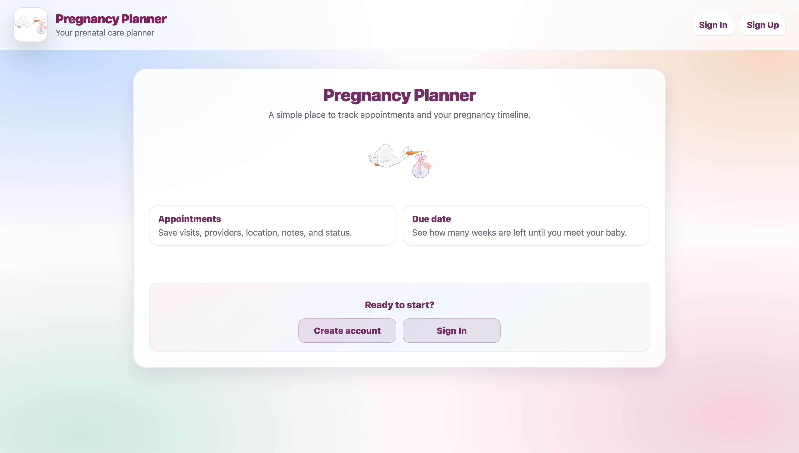
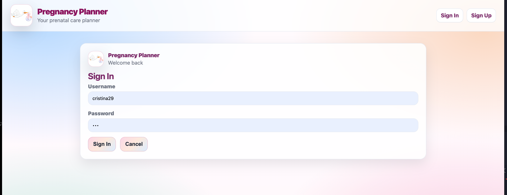
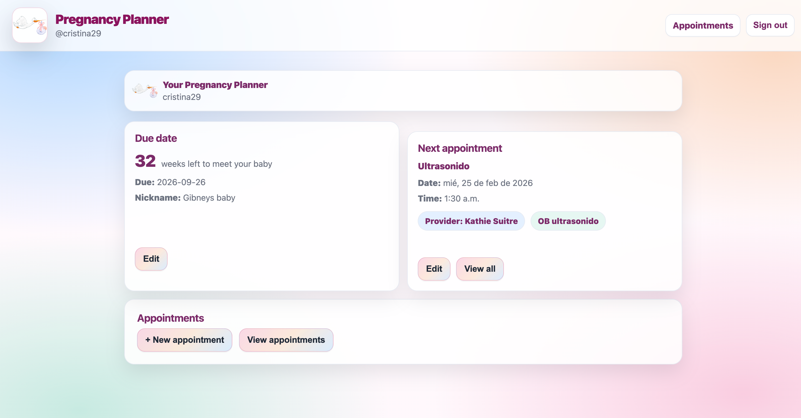
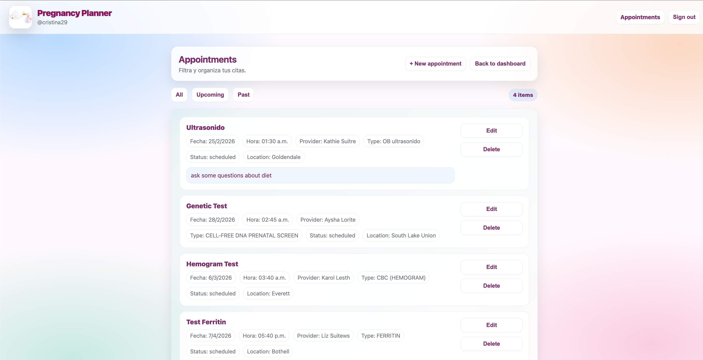
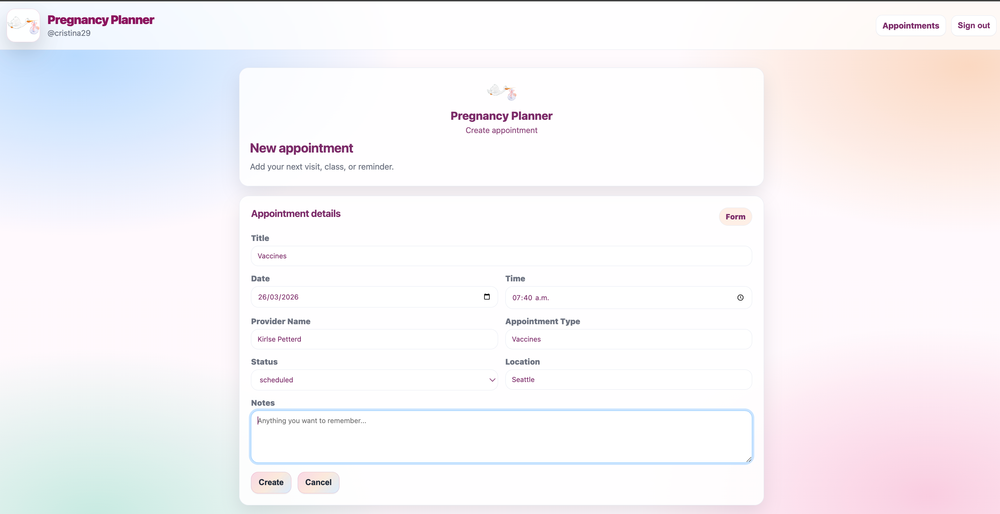
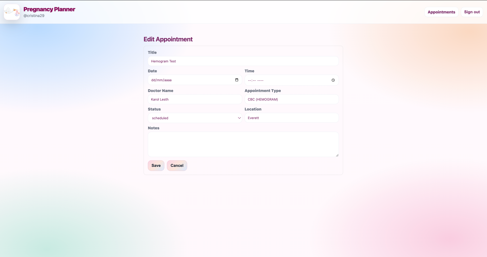

**Pregnancy Planner**

A full-stack web application built with Flask, PostgreSQL, and React, designed to help expecting parents organize and track their prenatal journey in a structured, secure, and emotionally calm environment.

📌 *Overview*

Pregnancy Planner is a secure web application that allows users to:

Track their estimated due date

Automatically calculate their current pregnancy week

Manage medical appointments

View their upcoming appointment

Keep their data private and protected

This project demonstrates full-stack architecture, secure authentication, and relational database design using SQL.

🖼️*Screenshots*

*Landing Page*

*Login / Register*

*Dashboard*

*Appointments List*

*Create Appointment*

*Edit Appointment*

**Stack Tecnológico**

🔹 *Frontend*

React

React Router

Context API

Custom CSS

useMemo (performance optimization)

🔹 *Backend*

Python

Flask

Flask Blueprints

JWT Authentication

psycopg2

🔹 *Database*

PostgreSQL

Relational schema design

Foreign key relationships

Parameterized SQL queries

🔹 Tools

Git & GitHub

Trello

Postman

VS Code

🔐 *Authentication & Security*

JWT-based authentication

Custom authentication middleware

Protected routes

User-specific data isolation

SQL injection prevention via parameterized queries

Each user can only access their own pregnancy profile and medical appointments.

🧩 *Database Model*

Relational structure:

Users
→ One-to-one relationship with Pregnancy Profile
→ One-to-many relationship with Appointments

✨ *Core Features (MVP)*

User registration

Login authentication

JWT token management

Main dashboard

Due date tracking

Automatic pregnancy week calculation

Create appointments

View appointments

Edit appointments

Delete appointments

Upcoming appointment preview

Clean and minimal interface

🚀 *Stretch Goals*

Trimester tracking

Weekly pregnancy milestones

Appointment filtering

Reminder system

Notes or journal section

PDF export

📎 *Project Links*

Deployed App: https://pregnancy-planner.netlify.app

GitHub Repositorys

Backend: https://github.com/CristinaGVO/pregnancy-planner-backend.git

Frontend: https://github.com/CristinaGVO/pregnancy-planner-frontend.git

Trello Planning Board: https://trello.com/b/JKaYopnH/proyect-4-pregnancy-planner

👩🏽‍💻 *Author*
Cristina Gibney
Software Engineering Student GA - 2026